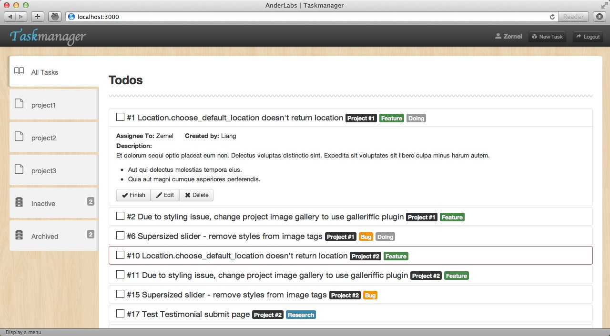

# Introduction

### Screenshots

## Project
### Status

* :active => { 项目里面包含未完成(:todo, :toreivew)的任务 }
* :inactive => { 项目内所有任务已经完成（:done） }
* :archived => { 项目已经归档 }
其中:active 和 :inactive 会根据 task 的更新自动更新，而:archived
主要为了方便分类而设置，不过当我们为archived的项目添加了一个新task时也会自动把它的状态切换回active

## Task
### Type

* :feature => { 功能性任务}
* :bug => { 修复错误 }
* :research => { 公司有需要用到某方面的技术，让你提前研究一下 }

### Status

* :todo => { 还没做的任务 }
* :toreview => { 已经完成等待检查 }
* :done => { 已经完成并检查完成 }

## Workflow
* 发布任务(task 状态为 :todo)
* 接收任务 Take (task 会添加label "doing" 还有设置 "Assignee to")
* 完成任务 Finish（task 状态会设置为 :toreview）
* 检查任务完成情况，如果完成，Checked!（task 状态会设置为
  :done，并把设置 checker）
* 检查任务完成情况，如果未完成或有问题，Rollback！然后更新
  description（task 状态会切换回 :todo，把 assignee 设置为 nil）

# TODO
# Version 0.2.0
* 邮件通知
* Daily Report
